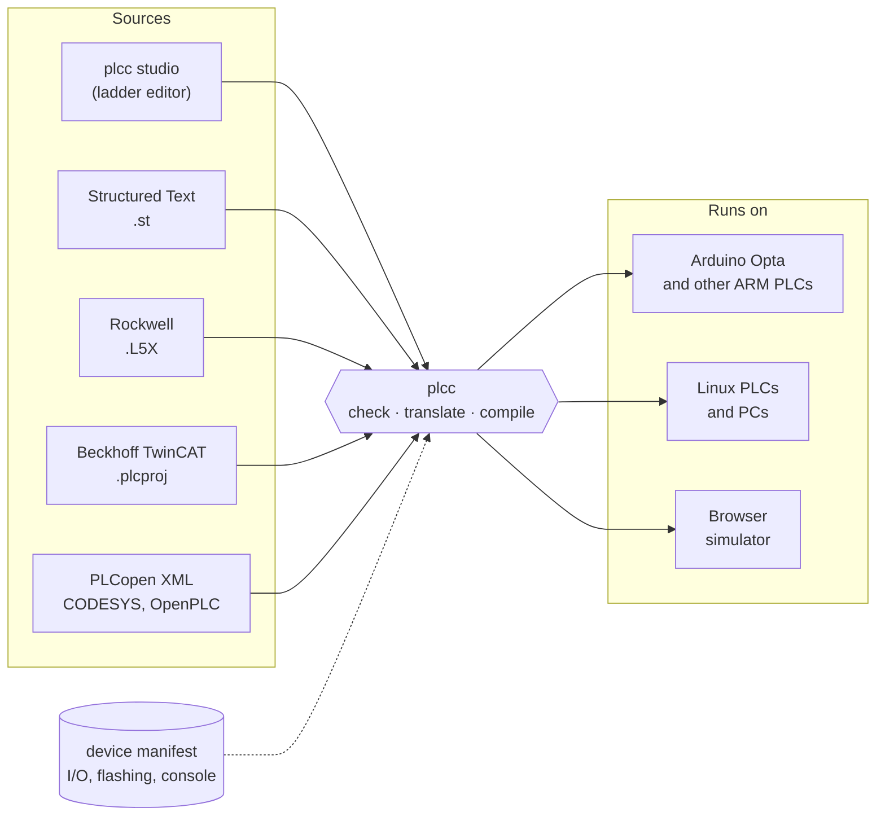

# plcc

Write PLC programs in ladder or Structured Text, and run them on open hardware.

plcc is an open-source compiler for IEC 61131-3, the standard language family of
industrial controllers. It turns ladder logic and Structured Text into native
machine code for whatever chip you have, and reads the project files engineers
already use: Rockwell Studio 5000, Beckhoff TwinCAT, CODESYS, and OpenPLC.

**[Open plcc studio →](https://beigesys.github.io/plcc/)** the ladder editor, in Chrome or Edge.


## What you can do

- **Edit ladder in the browser.** Draw rungs or type them (`XIC Start XIO Stop OTE Motor`),
  simulate them, and watch a real PLC live over USB. Nothing to install; projects stay in
  your browser.
- **Bring existing programs.** Rockwell `.L5X`, Beckhoff TwinCAT projects, and PLCopen XML
  (exported by CODESYS, OpenPLC and others) compile as they are.
- **Translate between them.** Ladder to Structured Text and back, IEC ladder to Rockwell
  ladder and back, with a warning wherever two vendors' instructions behave differently.
- **Run it on real hardware.** Native code for ARM, x86, RISC-V or WebAssembly. Each board is
  described by a small [device manifest](https://github.com/beigesys/plcc-devices); the
  Arduino Opta is the first.

## How it fits together



A compiled program doesn't know which board it runs on. It reads inputs and writes
outputs through a standard process image (`%I`, `%Q`, `%M`), and a small runtime
written once per board connects that image to the real terminals.

## Try it

1. Open **[plcc studio](https://beigesys.github.io/plcc/)**, pick **Simulate**, and flip
   the virtual StartPB input.
2. Or compile from the command line:
   ```bash
   plcc compile motor.st -o motor.o --device arduino-opta
   ```
   Building plcc and every other command: [docs/development.md](docs/development.md) and
   [docs/cli.md](docs/cli.md).

## Status

plcc is young and moving fast. What has been shown to work:

- **The compiler:** the full Structured Text language, about 1,000 automated tests, and the
  559-file OSCAT library compiling as one program.
- **Real hardware:** ST, PLCopen ladder and Rockwell ladder programs have each run on an
  Arduino Opta, switching its relays and talking Modbus RTU.
- **Real projects:** 71% of public hand-made L5X exports compile, and every public TwinCAT
  project tested parses (most of the rest need Beckhoff's own libraries).

Still experimental: the studio's online connection to real hardware, flashing from the
browser, compiling inside the browser, and **plcrt**, our own bare-metal runtime.
Known gaps are listed in [docs/known-issues.md](docs/known-issues.md).

## Learn more

| | |
|---|---|
| [Language support](docs/language.md) | What compiles, the standard library, targets |
| [Command line](docs/cli.md) | Every `plcc` command and input format |
| [Running programs](docs/runtime.md) | The runtime contract and hardware abstraction layer |
| [Ladder](docs/ladder.md) · [Translation](docs/ladder-translation.md) | Ladder formats, IEC ↔ Rockwell mapping |
| [Rockwell L5X](docs/l5x.md) · [TwinCAT](docs/twincat.md) · [CODESYS](docs/codesys-compatibility.md) | Vendor formats and behaviour |
| [Device manifests](docs/device-manifest.md) | Describing a board |
| [Developing plcc](docs/development.md) | Layout, building, tests |

## License

[Mozilla Public License 2.0](LICENSE), with a
[compiler output exception](LICENSE-EXCEPTION): programs you compile with plcc carry no
license obligation, and you can link the runtime into a proprietary product. Improvements
to plcc's own files come back under the MPL. Device manifests are
[CC0](https://github.com/beigesys/plcc-devices/blob/main/LICENSE).

Contributions are welcome, signed off under the [DCO](CONTRIBUTING.md). No CLA.
