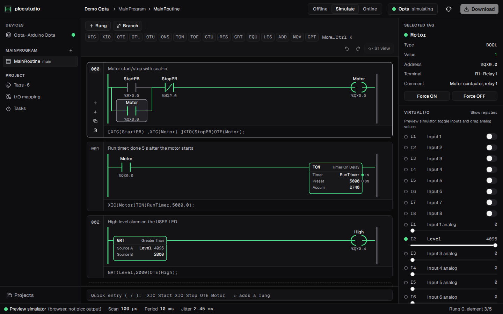
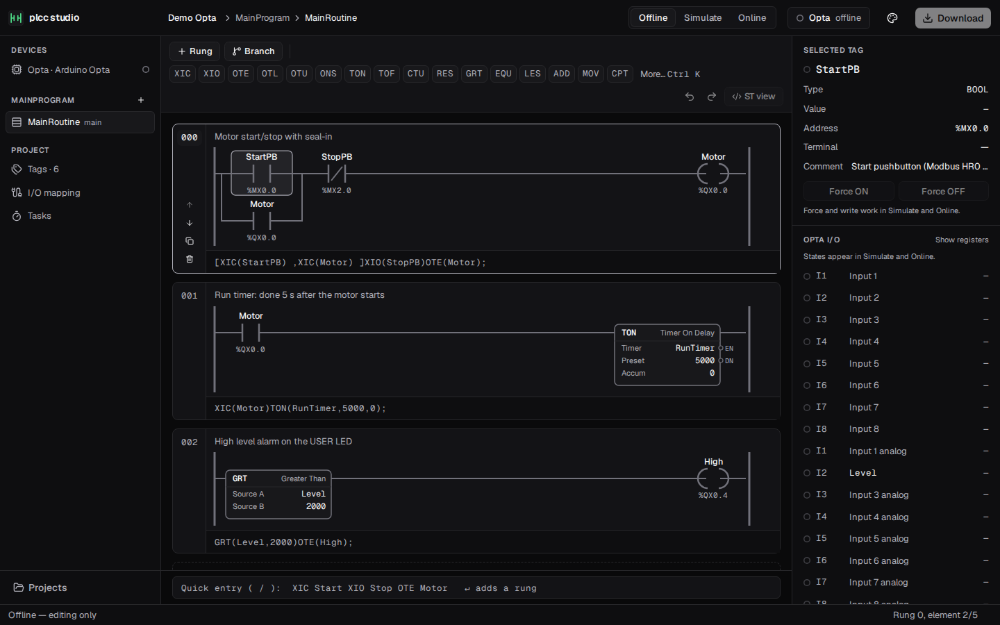
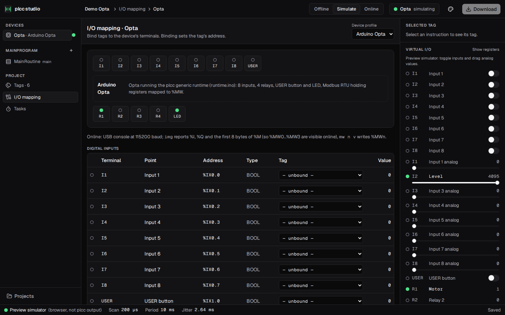
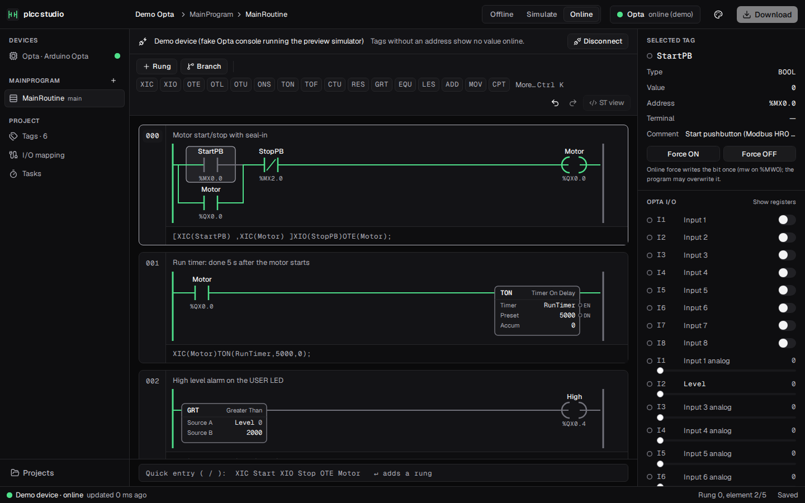
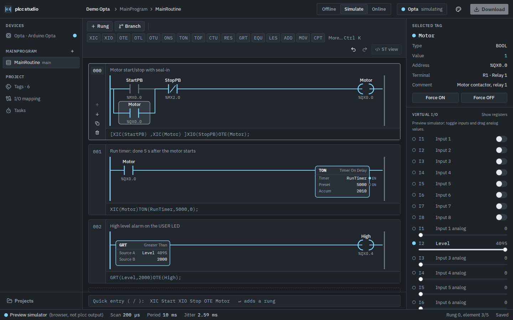
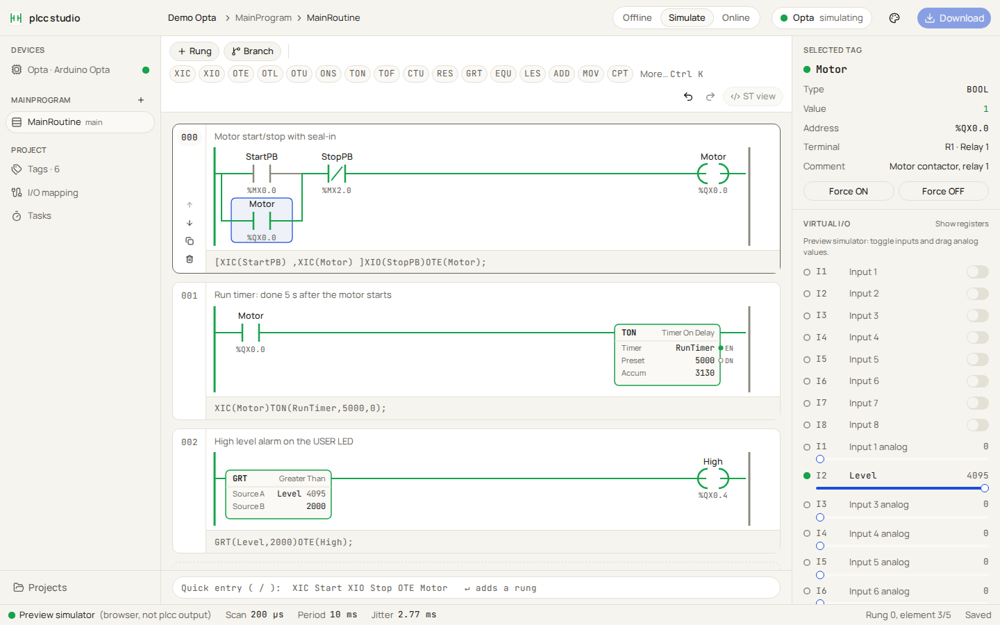

<!-- SPDX-License-Identifier: MPL-2.0 -->

# plcc studio

A web ladder editor for PLC programs, built for plcc. This first phase runs
entirely in the browser with no backend. You can edit ladder rungs, run them in
a preview simulator, and watch a real Arduino Opta over its USB console.
Projects are stored in the browser's Origin Private File System (OPFS).



## Run it

```bash
cd studio
npm i
npm run dev          # http://localhost:5173
```

Other scripts:

| Script | What it does |
|---|---|
| `npm test` | vitest unit tests: model, rung text, engine, loop and worker host, serial protocol, store, editing commands |
| `npm run lint` | ESLint (typescript-eslint, react-hooks) |
| `npm run build` | type check (`tsc -b`, strict), then the production bundle in `dist/` |
| `npm run screenshots` | builds the app, drives it in headless Chromium, and writes `docs/screenshots/*.png` and `perf.json`. Run `npx playwright install chromium` once first |

Online mode needs Chrome or Edge, because WebSerial is only in Chromium browsers.
The page must be served from `localhost` or `https`.

## Screens

| | |
|---|---|
| Offline editing |  |
| Simulate |  |
| I/O mapping |  |
| Online (demo device) |  |
| Control Room theme |  |
| Blueprint theme |  |

The layout has five parts:

- **Top bar (52 px):** logo, a project / program / routine breadcrumb, the
  Offline | Simulate | Online switch, a device status chip, the theme menu, and
  Download.
- **Left nav (232 px):** devices, programs and their routines, then the project
  views: Tags, I/O mapping and Tasks.
- **Center:** the rung list. Each rung is a card with a number gutter, a
  comment, the SVG ladder, and an editable rung-text bar in monospace.
- **Right inspector (300 px):** the selected tag (type, value, address,
  terminal, comment), Force ON/OFF, and the device's I/O list with state dots.
  In Simulate this list becomes the virtual I/O panel.
- **Status bar (30 px):** comms state, scan time, period, jitter, overruns,
  the cursor position, and the save state.

## Editing

The editor works from the keyboard first. Click a rung or press Tab to focus
the rung list, then:

| Key | Action |
|---|---|
| Arrow keys | Left/right move through the instructions of a rung. Up/down move to the next branch of a parallel, or to the next rung |
| `c` / `C` | insert XIC / XIO after the selection |
| `o`, `l`, `u` | insert OTE, OTL, OTU |
| `b` | command palette, to pick a box instruction (TON, GRT, ...) |
| `p` | add a parallel branch around the selection (on a branch: add another leg) |
| `n` | new rung below |
| Enter | edit the selected instruction's operands, with tag autocomplete |
| Delete / Backspace | delete the instruction, or the rung if only the rung is selected |
| Alt + Up/Down | move the rung up or down |
| Alt + Left/Right | move the instruction within its branch |
| `t` | edit the rung's text |
| `/` | quick entry |
| Space | Simulate/Online: toggle the selected contact's tag |
| Ctrl+K | command palette |
| Ctrl+Z / Ctrl+Y | undo / redo |

Other ways to edit:

- **Quick entry** is the box under the rungs and also the command palette.
  Typing `XIC Start XIO Stop OTE Motor` and pressing Enter adds a rung. Branches
  are written as `BST ... NXB ... BND` or `[ ... , ... ]`. Any text containing
  `(` is read as rung text instead.
- **Rung text** is the bar under each rung. Edit it and press Enter, and the
  drawing is rebuilt. Instruction ids are kept wherever the rung's shape still
  matches. Parse errors are shown in the fault color with their column.
- **The toolbar** has chips (XIC, OTE, TON, ...). Click one to insert it after
  the selection, or drag it onto an instruction or a rung.
- **New tags** are created the first time a tag is used, with a type inferred
  from the instruction:
  - contacts, coils, and ONS/OSR bits get BOOL
  - TON/TOF/RTO get TIMER
  - CTU/CTD get COUNTER
  - math and compare operands get DINT
- **Rungs** can be added, deleted, duplicated and reordered, and each has an
  inline comment.

Instructions in the draft model:

- Contacts: XIC, XIO, XICR (rising edge), XICF (falling edge).
- Coils: OTE, OTEN (negated), OTL, OTU, OTER (rising edge), OTEF (falling edge).
- Timers and counters: TON, TOF, RTO, CTU, CTD, RES.
- One-shots: ONS, OSR.
- Compares: EQU, NEQ, GRT, GEQ, LES, LEQ.
- Math and moves: ADD, SUB, MUL, DIV, MOV, CPT.
- Program flow: JSR.
- `ST("...")`: an inline Structured Text box.

The edge-sensing contacts and coils and the ST box are plcc extensions. The rest
use Logix names.

## Architecture

```
src/
  model/      draft project + ladder types, instruction catalog, rung text
              parse/print/quick entry, pure tree edits, %I/%Q/%M addresses and
              the process image. The ONLY module that knows the model's shape.
  engine/     preview simulator: Logix-like scan, TagStore backed by the process
              image, forces, CPT expression evaluator, per-scan time budget,
              pure trace for Online
  runtime/    fixed-period scan loop (drift correction, bounded catch-up),
              SimHost + sim.worker.ts (simulator in a Web Worker), messages
  devices/    device profiles as data (Arduino Opta, Simulator)
  serial/     console protocol (img / mw), OnlineSession (polling, misses,
              recovery, faults), WebSerial transport, FakeOptaTransport
  store/      FileStore (OPFS or memory), project <-> files, ProjectRepo,
              zip export/import, autosave debouncer
  state/      zustand stores: editor (project, undo/redo, view, selection),
              live (sim/online values), commands, persistence, theme
  ui/         React components; ladder/ has the SVG layout + renderer
  theme/      themes.css: every color is a token
```

- **The UI thread is never blocked.**
  - The simulator runs in a dedicated worker. It scans on a fixed-period loop:
    each scan is due at `start + k × period`, and the loop catches up if the
    timer fires late. A 4 ms setTimeout clamp still produces 1 ms scans with
    the right simulated time.
  - The worker posts a snapshot of power flow and *changed* tag values at most
    about 30 times a second. The main thread merges snapshots once per
    animation frame.
  - Each scan has a time budget (50 ms). A scan that runs past it is cut short
    and counted as an overrun in the status bar, so the loop never spins.
  - Online polling is async and timer driven, and never waits in a loop.
  - OPFS writes are async and debounced (600 ms).
- **Measurement:** `npm run screenshots` writes `docs/screenshots/perf.json`.
  On the production build in headless Chromium, the main thread holds 60 fps
  (p99 frame 16.8 ms) with no long tasks, both offline and with the simulator
  scanning every 1 ms. `src/runtime/runtime.test.ts` also checks that a 1 ms
  loop leaves the event loop free even when it shares the thread.
- **Themes:** there are three.
  - *Graphite* is the dark default.
  - *Control Room* is an ISA-101 style HMI theme with IBM Plex fonts.
  - *Blueprint* is light, with Manrope and JetBrains Mono.

  Until you pick one, the theme follows `prefers-color-scheme`. The choice is
  stored in `localStorage`. All three follow the ISA-101 rule that color is used
  only for state:
  - `--power` means energized.
  - `--alarm` (amber) means abnormal: unassigned operands, a simulator error
    on a rung, address/type mismatches.
  - `--fault` (red) means an error: parse errors, a PLC STOP.

  Everything else is neutral.

## Model

These are the draft types in `src/model/types.ts`. They will be swapped for the
`plcc-ladder` crate's JSON. Only `types.ts` and `store/serialize.ts` should need
to change when that happens.

```ts
Project  { name, devices: DeviceRef[], tasks: Task[], programs: Program[], tags: Tag[] }
DeviceRef{ name, profile }                      // profile id from src/devices
Task     { name, intervalMs, programs: string[] }
Program  { name, main, routines: Routine[] }
Routine  { name, kind: 'ladder' | 'st', rungs: Rung[], st?: string }
Tag      { name, type, initial, address?: '%IX0.0', comment }
Rung     { id, comment, body: Series }
Element  = Series   { type: 'series', items: Element[] }
         | Parallel { type: 'parallel', id, branches: Series[] }
         | Contact  { type: 'contact', id, kind: 'no'|'nc'|'rise'|'fall', tag }
         | Coil     { type: 'coil', id, kind: 'normal'|'negated'|'set'|'reset'|'rise'|'fall', tag }
         | Box      { type: 'box', id, instr: BoxInstr, operands: Record<string, string> }
         | StBox    { type: 'st', id, code }
```

`Box.operands` keys come from the instruction catalog
(`src/model/instructions.ts`). For example, TON has `timer`, `preset` and
`accum`; GRT has `a` and `b`; MOV has `source` and `dest`. Every instruction has
a stable `id`.

### On disk (OPFS)

```
projects/<id>/project.toml                 name, [[devices]], [[tasks]], [[programs]] (+ routine names/kinds)
projects/<id>/tags.toml                    [[tag]] name, type, initial, address, comment
projects/<id>/routines/<name>.ladder.json  { "format": "plcc-studio-ladder", "version": 1, "name", "rungs" }
projects/<id>/routines/<name>.st           ST routines
```

Export and import produce the same files inside a `.zip`. TOML is handled by
smol-toml and zip by fflate, both MIT. If OPFS is unavailable (a private window,
an old browser), projects are kept in memory and the status bar says so.

## What works

- **Offline editing:**
  - rungs, branches and every instruction above
  - rung comments and rung text in both directions
  - undo/redo, drag and drop, the command palette, quick entry
  - tag autocomplete and tag creation on first use
  - an ST routine editor (it saves source but does not check it)
- **Tags:**
  - a table editor for name, type, initial value, address and comment
  - renaming a tag also renames every reference to it
  - address/type mismatch and duplicate-address warnings
  - live values in Simulate and Online
- **I/O mapping:**
  - the device's terminals as a diagram and as tables
  - binding a tag to a point, which sets the tag's address
  - creating a new tag for a point
  - type-mismatch and shared-address warnings, and tags whose addresses are
    not on the device
  - switching the device profile
- **Tasks:** interval and program assignment. The simulator scans at the first
  task's interval.
- **Simulate:** the in-browser *preview* simulator. It is labelled as such and
  is not plcc output.
  - Series is AND, parallel is OR.
  - OTE/OTL/OTU, negated and edge coils, edge contacts.
  - ONS/OSR.
  - TON/TOF/RTO with .PRE/.ACC/.EN/.TT/.DN in ms.
  - CTU/CTD/RES.
  - Compares, ADD/SUB/MUL/DIV, MOV, CPT expressions, JSR.
  - Tags with an %I/%Q/%M address live in the process image.
  - Virtual I/O: switches for digital inputs, sliders for analog inputs.
  - Force ON/OFF, value writes, and Space or double-click on a contact to
    toggle it.
  - Live power flow.
- **Online:** WebSerial to the Opta's USB console at 115200 baud.
  - `img` is polled every 100 ms and the %I, %Q and first 8 %M bytes are
    decoded.
  - Tags with an address show live values, and power flow is computed from
    them.
  - Force ON/OFF on %M BOOL tags is a read-modify-write of the containing word
    with `mw`. %MXb.x lives in byte b, and %MWn is bytes 2n..2n+1, little-endian.
  - `%MW` tags can be written.
  - Missed polls become an alarm state and recover on their own.
  - `PLC STOP` fault lines are shown.
  - A disconnect is handled cleanly.
  - **Demo device** runs the same console protocol against a fake Opta that
    runs the preview simulator, so Online mode can be tried without hardware.

### Trying Online with a real Opta

1. Flash the generic runtime with your program
   (`~/opta_plcc/build.sh prog.xml`, see `docs/ladder.md`). The demo project's
   tags match the demo rungs: StartPB `%MX0.0`, StopPB `%MX2.0`, Motor `%QX0.0`
   (relay 1), Level `%IW2`, High `%QX0.4` (USER LED).
2. Close anything else that holds the serial port, such as `arduino-cli
   monitor`.
3. In Chrome, open the studio, switch to **Online**, click **Connect USB...**
   and pick the Opta's port.
4. Select StartPB and press Force ON then Force OFF. Relay 1 should seal in.
   Force StopPB ON to drop it.

The WebSerial transport is untested against real hardware. The protocol layer
(`src/serial/`) is tested against `FakeOptaTransport`, which reproduces the
firmware's `img` / `mw` output byte for byte, including the unpadded hex.

## Placeholders in this phase

- **Download**, the **ST view** of a ladder routine, and compiling are disabled.
  Their tooltip says "needs plcc serve — phase 2".
- ST routines and inline ST boxes are edited and saved but not simulated. An ST
  box passes power through and flags "ST box not simulated".
- There is one device per project in the UI, although the model allows more.

## Phase 2 plan

1. **`plcc serve`**: a local HTTP/WebSocket service around the plcc compiler.
   The studio sends the project (the `plcc-ladder` JSON) and gets back
   diagnostics with spans that map to rung and element ids, the generated ST
   (the "ST view"), and compiled artifacts.
2. **Real simulation from wasm32**: compile with
   `plcc compile --target wasm32-unknown-unknown` and run the module in the
   existing simulator worker in place of the TypeScript engine. The worker
   protocol (snapshots of changed values plus power flow, the fixed-period loop
   and the scan budget) stays the same. Power flow comes from the `_ld_*`
   hidden variables or a trace table emitted by plcc.
3. **Download over WebUSB DFU**: build the Opta runtime with the compiled
   object on the server, then flash it from the browser with WebUSB DFU (the
   Opta's STM32H747 bootloader). This replaces the `arduino-cli upload` step.
4. **Swap the draft model** for the `plcc-ladder` crate's schema, which
   converts to and from L5X, PLCopen XML and TwinCAT. That turns import and
   export of those formats into studio features.
