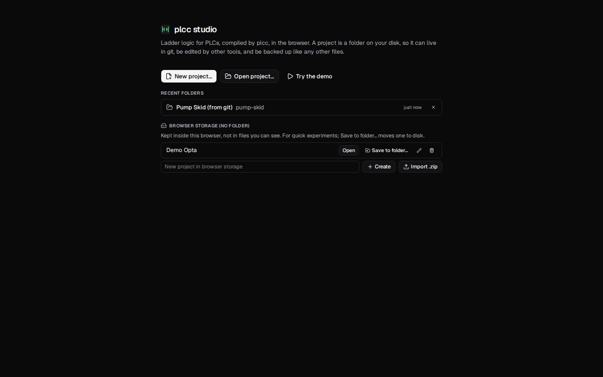
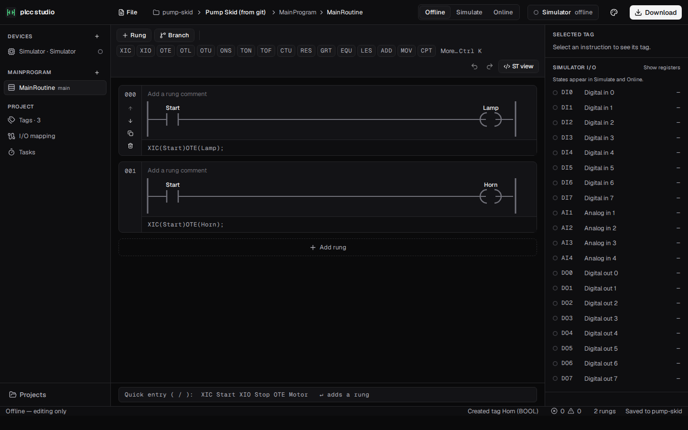
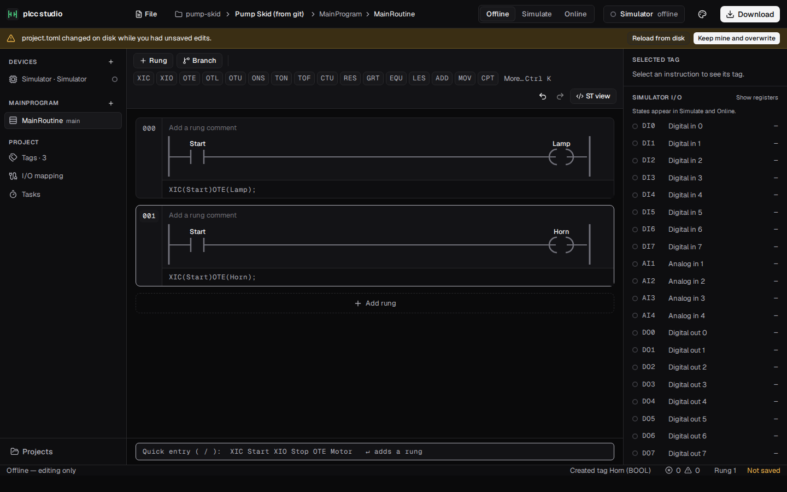
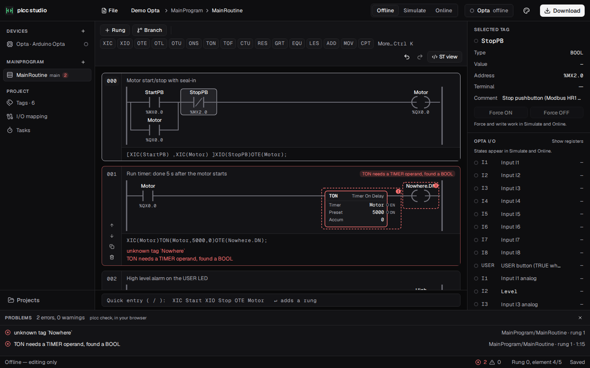
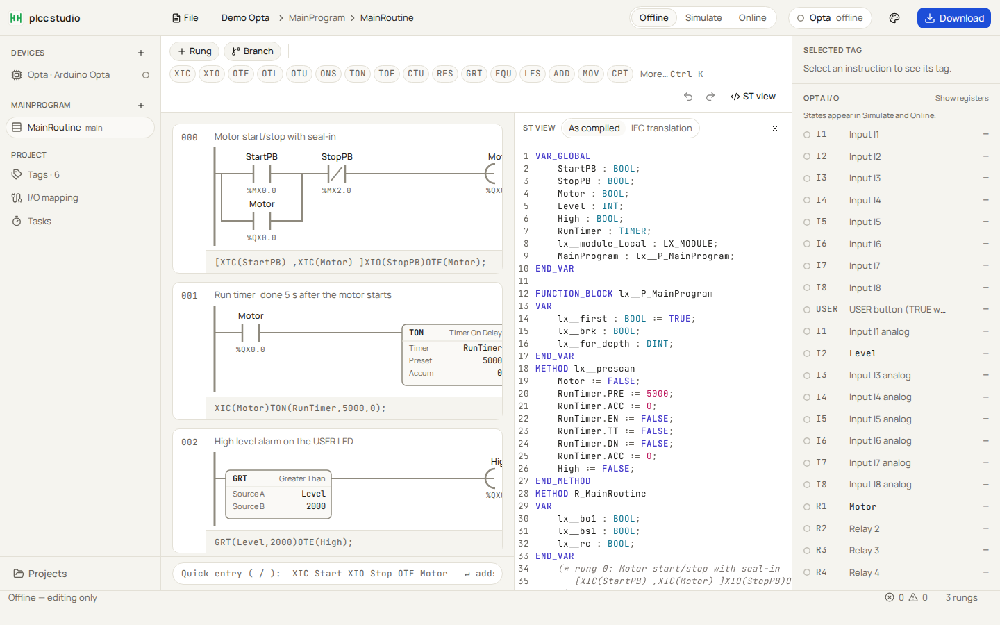
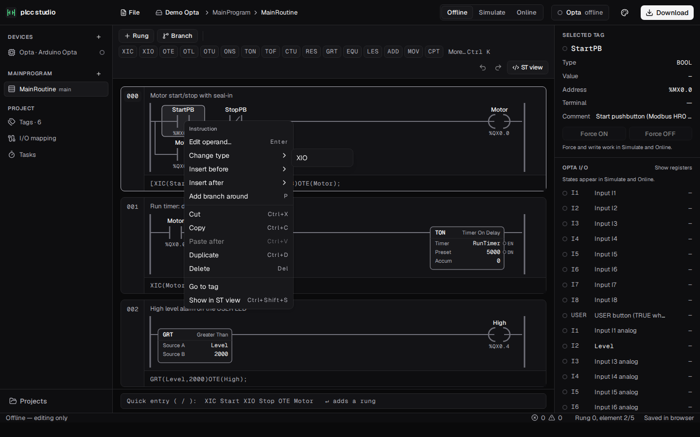
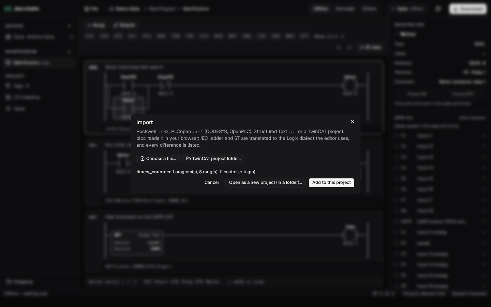
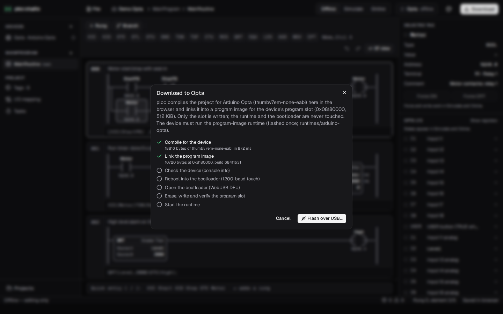

<!-- SPDX-License-Identifier: MPL-2.0 -->

# plcc studio

A web ladder editor for PLC programs, built on plcc. Everything runs in the
browser, with no server of any kind: a project is a folder on your disk
(opened like in a desktop IDE, so it can live in git, be edited by other
tools and be backed up), plcc itself (its front end, its LLVM code generator
and its linkers) runs as WebAssembly in Web Workers, the simulator runs
plcc's own build of the project, and an Arduino Opta is watched over
WebSerial and flashed over WebUSB.


## Run it

```bash
cd studio
npm i
npm run dev          # http://localhost:5173
```

The browser packages it uses are siblings in `../packages` and are linked, not
copied (`.npmrc`). Two of them carry WebAssembly that is built, not committed:

| Package | Build | Without it |
|---|---|---|
| `@plcc/plcc-wasm` (front end, 2.2 MB) | `cd ../packages/plcc-wasm && npm run build` (wasm-bindgen-cli 0.2.129) | the studio does not build |
| `@plcc/plc-image` (program image linker, 88 KB) | `cd ../packages/plc-image && sh build.sh` | Download cannot link |
| `@plcc/plcc-compiler-wasm` (the compiler, 10 MB gzip) | `../packages/plcc-compiler-wasm/build.sh` (LLVM for WASI; docs/studio-wasm.md) | Simulate runs the preview engine, Download cannot compile |

| Script | What it does |
|---|---|
| `npm test` | vitest: model and rung text, golden tests against plcc-wasm (the model round-trips through plcc, rung text reads as plcc reads it, the catalog is plcc's), migration of old projects, the command registry, the preview engine, the simulator worker running plcc's real build, Download against a fake bootloader, the serial protocol and the WebSerial transport, the store, and projects in folders against an in-memory FileSystemDirectoryHandle (new / open / recent, permission prompts and denials, moved folders, changes on disk, conflicts). Tests that need a built wasm package skip without it. |
| `npm run lint` | ESLint (typescript-eslint, react-hooks) |
| `npm run build` | type check (`tsc -b`, strict), then the production bundle in `dist/` (with the compiler in `dist/plcc-compiler/` when it is built) |
| `npm run screenshots` | builds the app, drives it in headless Chromium, checks the flows end to end (below) and writes `docs/screenshots/*.png` and `perf.json`. `STUDIO_BASE=/plcc/` runs it as GitHub Pages serves it. Run `npx playwright install chromium` once first |

Online, Detect and Download need Chrome or Edge (WebSerial, WebUSB), served
from `localhost` or `https`. GitHub Pages builds it all in CI
(`.github/workflows/studio-pages.yml`).

## Screens

| | |
|---|---|
| Start screen |  |
| A project in a folder |  |
| Changed on disk while editing |  |
| Offline editing |  |
| Simulate (plcc's wasm32 build) |  |
| plcc's diagnostics on a broken rung, Problems |  |
| ST view |  |
| Right-click menu |  |
| Import (L5X) |  |
| Download |  |
| I/O mapping |  |
| Online (demo device), serial log |  |
| Control Room theme |  |
| Blueprint theme |  |

The layout has five parts:

- **Top bar (52 px):** logo, File (New project…, Open project…, Open
  recent, Save to folder…, import, export, Close project), a folder /
  project / program / routine breadcrumb, the Offline | Simulate | Online
  switch, a device status chip, the theme menu, and Download. Under it, a
  banner when the project's folder needs you (below).
- **Left nav (232 px):** devices, programs and their routines (with their
  problem counts), then the project views: Tags, I/O mapping and Tasks.
- **Center:** the rung list. Each rung is a card with a number gutter, a
  comment, the SVG ladder, and an editable rung-text bar in monospace with
  plcc's diagnostics for the rung under it. The ST view opens beside it.
- **Right inspector (300 px):** the selected tag (type, value, address,
  terminal, comment), Force ON/OFF, the selected instruction's problems, and
  the device's I/O list with state dots. In Simulate this list becomes the
  virtual I/O panel.
- **Problems panel** (from the status bar's counter) and the **status bar
  (30 px):** what runs the simulation, scan time, period, jitter, the
  problem counts, the cursor position, and the save state (`Saved to
  <folder>`, `Unsaved`, `Not saved` while a banner is up).

## Editing

The editor works from the keyboard first. Click a rung or press Tab to focus
the rung list, then:

| Key | Action |
|---|---|
| Arrow keys | Left/right move through the instructions of a rung. Up/down move to the next leg of a branch, or to the next rung |
| `c` / `C` | insert XIC / XIO after the selection |
| `o`, `l`, `u` | insert OTE, OTL, OTU |
| `b` | command palette, to pick a box instruction (TON, GRT, ...) |
| `p` | add a branch around the selection (on a branch: add another leg) |
| `n` / `Shift+N` | new rung below / above |
| Enter | edit the selected instruction's operands, with tag autocomplete |
| Delete / Backspace | delete the instruction, or the rung if only the rung is selected |
| Ctrl+C / Ctrl+X / Ctrl+V / Ctrl+D | copy, cut, paste, duplicate (as rung text, also on the system clipboard) |
| Alt + Up/Down | move the rung up or down |
| Alt + Left/Right | move the instruction within its branch |
| `t` | edit the rung's text |
| `/` | quick entry |
| Space | Simulate/Online: toggle the selected contact's BOOL tag |
| Shift+F10, the Menu key | the selection's context menu |
| Ctrl+Shift+S | ST view |
| Ctrl+K | command palette |
| Ctrl+Z / Ctrl+Y | undo / redo |

**Right-click menus** on instructions (edit, change type XIC ↔ XIO, OTE ↔
OTL ↔ OTU, TON ↔ TOF ↔ RTO, ...; insert before / after; add a branch; cut,
copy, paste, duplicate, delete; go to tag; show in ST view; toggle and force
in Simulate and Online), rungs (insert above / below, duplicate, move, edit
comment, copy and paste as rung text, delete), tags in the tag table, the
inspector and the I/O list (go to usages, rename, map to a terminal, force,
copy name), routines (open, rename, duplicate, export as ST / PLCopen /
L5X, delete) and devices (detect, change, view manifest, update). Menus,
keys and the palette all run the same commands (`src/state/registry.ts`),
and every menu item shows its shortcut.

Other ways to edit:

- **Quick entry** is the box under the rungs and also the command palette.
  Typing `XIC Start XIO Stop OTE Motor` and pressing Enter adds a rung.
  Branches are written as `BST ... NXB ... BND` or `[ ... , ... ]`. Any text
  containing `(` is read as rung text instead.
- **Rung text** is the bar under each rung, in the canonical form Studio 5000
  exports and plcc writes into L5X: `[XIC(StartPB) ,XIC(Motor) ]XIO(StopPB)OTE(Motor);`.
  Edit it and press Enter, and the drawing is rebuilt. Instruction ids are
  kept wherever the rung's shape still matches.
- **The toolbar** has chips (XIC, OTE, TON, ...). Click one to insert it after
  the selection, or drag it onto an instruction or a rung.
- **New tags** are created the first time a tag is used, with a type inferred
  from the instruction: contacts, coils and ONS/OSR/OSF bits get BOOL;
  TON/TOF/RTO get TIMER; CTU/CTD get COUNTER; math and compare operands get
  DINT.

The editor speaks Logix ladder (plcc-ladder's Logix dialect): XIC, XIO, OTE,
OTL, OTU, ONS, OSR, OSF, TON, TOF, RTO, CTU, CTD, RES, EQU, NEQ, GRT, GEQ,
LES, LEQ, LIM, ADD, SUB, MUL, DIV, MOV, CPT, JSR, JMP / LBL, RET, and an
`ST("...")` box of Structured Text (plcc writes it to L5X as an ST routine
called by JSR). Any other of plcc's 91 Logix instructions (from an import, or
typed as rung text) is drawn as a box with its operands named from plcc's
catalog and compiled by plcc.

## Architecture

```
src/
  model/      plcc-ladder's model as TypeScript (types.ts), its JSON (json.ts),
              rung text, the instruction catalog (logix-catalog.json, from
              plcc), tree edits, ids, addresses and the process image, and the
              migration of the first studio's projects
  plcc/       the workers: plcc's front end (frontend.ts, check / convert /
              manifests) and its compiler (compiler.ts, loaded on demand)
  engine/     the preview engine (a Logix-like interpreter of the model) and
              the pure power-flow trace used by Simulate and Online
  runtime/    the simulator worker: SimWorker runs the preview engine, then
              plcc's build (PlcHost, @plcc/plc-wasm); fixed-period loop
  devices/    device manifests: TOML loader and validator, the catalog, a
              project's devices
  serial/     console protocol, OnlineSession (info, img polling, mw, prog /
              stop / run, the traffic log), WebSerial transport, fake console
  store/      FileStore over a directory handle (a folder on disk, or OPFS)
              or memory, project <-> files, ProjectFolder (one project's
              files, change detection), ProjectRepo (browser storage), recent
              folders (IndexedDB), the folder watcher, zip, autosave
  state/      zustand stores: editor, live values, problems (plcc check),
              simulate (builds), download, convert (import / export), the
              command registry and its commands, persistence, theme
  ui/         React components; ladder/ has the SVG layout and renderer
```

What runs where (docs/studio-wasm.md has the details and the numbers):

| Thread | What |
|---|---|
| page | the editor, project folders and OPFS, WebSerial (Online), WebUSB (Download) |
| front-end worker | `@plcc/plcc-wasm` (765 KB gzip): check after edits (debounced 400 ms), the ST view and import / export (convert), manifest validation, fault sites |
| compiler worker | `@plcc/plcc-compiler-wasm` (10.2 MB gzip, fetched on the first Simulate or Download, cached in Cache Storage by its SHA-256): a fresh instance per build |
| simulator worker | the preview engine, then plcc's wasm32 build run by `@plcc/plc-wasm` |

- **The UI thread is never blocked.** Checks, builds and scans run in workers.
  The simulator posts a snapshot of power flow and *changed* tag values at
  most about 30 times a second; the page merges snapshots once per animation
  frame. On the production build in headless Chromium the page holds 60 fps
  (p99 frame 16.8 ms, no long tasks) with plcc's program running
  (`docs/screenshots/perf.json`).
- **Themes:** *Graphite* (dark, default), *Control Room* (ISA-101 HMI, IBM
  Plex) and *Blueprint* (light). Until you pick one, the theme follows
  `prefers-color-scheme`. Color is used only for state: `--power` energized,
  `--alarm` (amber) abnormal (warnings, unassigned operands, the preview
  engine), `--fault` (red) errors (plcc's errors, a faulted PLC).

## Model

A project is plcc's ladder model — crate `plcc-ladder`,
`crates/plcc-ladder/src/model.rs`, documented in
[docs/ladder-translation.md](../docs/ladder-translation.md) — in the Logix
dialect, plus the project's devices. `src/model/types.ts` mirrors the Rust
types field for field:

```ts
Project  { dialect: 'logix', name, globals: Variable[], pous: Pou[], declarations, tasks: Task[],
           devices: DeviceRef[], deviceFiles }             // the last two are the studio's
Pou      { id, name, kind: 'program', variables: Variable[], routines: Routine[] }  // routines[0] is the main routine
Routine  { id, name, rungs: Rung[] }                       // one rung holding one ST box: an ST routine
Rung     { id, comment?, label?, elements: Element[] }
Element  = { type: 'contact', id, operand, kind: 'no' | 'nc' }
         | { type: 'coil', id, operand, kind: 'normal' | 'set' | 'reset' }
         | { type: 'branch', id, legs: Element[][] }
         | { type: 'block', id, name, pins: { name, dir, value }[] }   // TON(Timer, Preset, Accum), ...
         | { type: 'jump', id, label } | { type: 'return', id } | { type: 'st', id, code }
Variable { name, data_type, section, initial?, address?, comment?, constant?, retain? }
Task     { name, interval_ms?, priority?, programs }
```

Ids are numbers unique in the project; plcc's diagnostics and fault sites
name them, so they land on the rung and element. Golden tests
(`src/model/plcc.test.ts`) round-trip projects through plcc-wasm's `convert`,
check that the rung text reads the way plcc reads it, that
`logix-catalog.json` is plcc's catalog (`node scripts/gen-catalog.mjs`
regenerates it), and that the demo checks clean.

plcc compiles the model as it compiles an L5X export: each variable's
`address` binds it to the process image (the L5X I/O map, docs/l5x.md), and
each task is a periodic (or continuous) Logix task.

### On disk

A project is a folder:

```
project.toml             format = 2, name, [[devices]] (name, manifest)
project.json             the plcc-ladder model: `plcc convert project.json --to l5x` works on it
devices/<device-id>.toml the project's copy of each device manifest (docs/device-manifest.md)
README.md                written once, by New project: the name, and how to open it
.gitignore               written once, by New project: lists .plcc/ (local, untracked state)
```

The files are meant for version control: JSON is two-space indented with a
stable key order, TOML is smol-toml's stable output, every file ends in a
newline, and none of them holds a timestamp or UI state. Saving the same
project twice writes the same bytes, and a save writes only the files whose
contents changed. What the studio remembers for you (the last view per
project, the theme, recent folders) stays in the browser: localStorage and
IndexedDB. The studio reads and writes only the files above, so a folder
can hold anything else (docs, a `.git`), and New project leaves an existing
README.md or .gitignore alone.

Projects saved by the first studio (`tags.toml`, `routines/*.ladder.json` in
its draft model) are migrated when opened and saved in format 2. Its
extensions that Logix has no instruction for become their Logix equivalents,
each reported: an edge contact becomes `XIC(x)OSR(edgeN_sb,edgeN)` in a rung
before and `XIC(edgeN)` in place; an edge coil `OSR` / `OSF`; a negated coil
an `OTE` of a helper and `XIO(helper)OTE(x)` in a rung after.

Export and import produce the same files inside a `.zip`. TOML is handled by
smol-toml and zip by fflate, both MIT.

### Projects, folders and the browser

With no project open, the studio shows a start screen:

- **New project…** opens the browser's folder picker. Pick an empty folder
  (the picker can create one); the project, a README.md and a .gitignore are
  written into it, and it opens. A folder that already holds a project is
  offered for opening instead; any other non-empty folder is refused
  (hidden entries such as `.git` do not count, so initializing a repository
  first is fine).
- **Open project…** opens a folder with `project.toml`; any other folder
  gets an error that says what to pick.
- **Recent folders** (also File > Open recent) reopen with a click. The
  browser keeps a handle to each folder (in IndexedDB), not its path. In a
  later visit the browser usually asks again for permission to edit the
  folder; the click is what lets it ask. If you say no, or the folder was
  moved or deleted, the studio says so and offers to remove the entry
  (Open project… finds a moved folder again). At startup the last folder
  reopens by itself only while the browser still grants access (Chrome's
  "Allow on every visit"); otherwise the start screen marks it "click to
  reopen".
- **Try the demo** opens the demo project in browser storage, picking
  nothing.
- **Browser storage (no folder)** keeps projects inside the browser's
  Origin Private File System, as the studio did before: for quick
  experiments, and for browsers without folder access. **Save to folder…**
  copies one into a picked folder and switches to it (the browser copy
  stays until you delete it).
- **Close project** (File) goes back to the start screen.

While a project is open:

- **Autosave** writes to its folder 600 ms after an edit settles. Each file
  is written through `createWritable()`, which writes a swap file and moves
  it into place on close, so another program never reads half a file.
- **Changes on disk** made by other programs (a checkout, an editor, a sync
  tool) are noticed: with `FileSystemObserver` where the browser has it
  (feature-detected), otherwise by checking the project files' size and
  modification time every 2 s while the tab is visible, and when it becomes
  visible again. A touch that leaves the contents alone is ignored. With no
  unsaved edits the project reloads, with a notice in the status bar. With
  unsaved edits a banner asks: **Reload from disk** (drop your edits) or
  **Keep mine and overwrite**; nothing is written until you choose. A save
  also checks first, so the studio never overwrites a change it has not
  seen. A file that cannot be read (say, conflict markers in project.json)
  keeps the editor's project and says why.
- **Losing access** (permission revoked in the browser's site settings)
  shows a banner with **Grant access**; your edits stay in the editor, and
  are saved once access is back. A folder deleted under the studio gets a
  banner with **Save to another folder…**.

| Browser | Projects in folders | Fallback |
|---|---|---|
| Chrome, Edge, Opera (desktop) | yes: `showDirectoryPicker`, handles in IndexedDB, permission prompts; changes noticed by polling, or `FileSystemObserver` where the browser has it | — |
| Firefox, Safari | no (`showDirectoryPicker` is Chromium-only) | browser storage (OPFS), with Import / Export .zip to back up or move a project, or to put it under version control; the start screen says so |
| No OPFS either (some private windows, old browsers) | no | memory only, until the tab closes; the status bar says so |

Folder access needs the page served from `localhost` or `https`.

## What works

- **Editing:** rungs, branches, every instruction above, comments, rung text
  both ways, undo/redo, drag and drop, the palette, quick entry, context
  menus, tag autocomplete and creation; ST routines.
- **Check (plcc):** after every edit, in a worker. Errors and warnings mark
  their element (and the operand's position in the rung text), list under the
  rung, count per routine in the left nav, and fill the Problems panel; ST
  routines mark their lines. Device manifests are validated by plcc too.
- **ST view:** the Structured Text plcc compiles a routine's program to (Logix
  semantics, calls into its Logix prelude), or its translation to IEC
  61131-3, with the translation's notes.
- **Import / export:** File > Import reads Rockwell `.L5X`, PLCopen `.xml`
  (CODESYS, OpenPLC), `.st` and TwinCAT projects (a `.zip`, or a folder in
  Chrome) through plcc's converter, translates IEC ladder and ST to Logix,
  lists every translation note, and adds the programs to the project or opens
  them as a new one. File > Export (and a routine's menu) writes L5X, PLCopen
  XML or IEC ST, with plcc's notes about what behaves differently.
- **Tags, I/O mapping, devices, tasks:** as before; tasks are periodic
  (interval) or continuous (empty), and each is compiled as such.
- **Simulate:** plcc compiles the project to wasm32 in the browser, links it,
  and the simulator worker runs it with `@plcc/plc-wasm`: plcc's task
  scheduler, the device's image sizes, every instruction plcc compiles. The
  first time, the compiler downloads (progress in the status bar); until the
  first build is ready, and whenever the project cannot be built, the
  TypeScript **preview** engine runs instead, labelled as such. Edits rebuild
  the program (a cold restart). Virtual I/O, force, write and toggle work as
  before; power flow is computed from the model and the program's live
  values. A PLC fault stops the program and is marked on its element.
- **Download:** compiles the project for its device (the manifest's triple,
  CPU, float ABI and image sizes), links a program image for the device's
  program slot (`@plcc/plc-image`), then, on a click: checks over the console
  that the board runs a program-image runtime of the same device (otherwise
  nothing is touched), reboots it into its bootloader (1200-baud touch), and
  writes and verifies only the program slot with `@plcc/webdfu`'s slot
  profile; leaving DFU starts the runtime. Tested end to end against webdfu's
  fake bootloader; not yet run against hardware (the program-image runtime
  has not been flashed to an Opta yet).
- **Online:** WebSerial to the device's USB console at the manifest's baud
  rate (115200 8N1, DTR asserted, commands ending in a single `\n`).
  - `info` first: the device id, runtime, ABI and image sizes are compared
    with the project's manifest. A program-image runtime also reports its
    program's state (running, stopped, empty, or the fault and its site),
    shown in the device chip, the banner and the inspector, with **Run** and
    **Stop**; `info` is re-read every second.
  - `img` is polled every 100 ms; %I, %Q and the manifest's `img_m_bytes`
    of %M are decoded; tags with an address show live values and power flow.
  - Force ON/OFF on %M BOOL tags is a read-modify-write of the containing
    word with `mw`; `%MW` tags can be written.
  - The **serial log** shows every line sent and received, timeouts and
    disconnects (img polls hidden by default), and saves it as text.
  - **Demo device** runs the same console protocol against a fake Opta.

### Checked end to end (`npm run screenshots`)

The start screen offers New, Open and the demo; the demo opens and checks
clean; right-click StartPB → Change type → XIO
changes it; Shift+F10 opens the menu; a broken rung gets plcc's diagnostics
on two elements and in Problems; the ST view shows the generated ST and the
IEC translation; Simulate runs plcc's build (1.6-1.7 s on a local server,
1.4 s from the cache after a reload), StartPB seals Motor in and RunTimer
accumulates about 1000 ms per second; Download builds the Opta image
(10.7 KB at 0x08180000); an L5X fixture and an ST file import; Online against
the demo device shows the console traffic and the program state; New
project… writes the project, README.md and .gitignore into a folder, edits
autosave to it, a change made on disk reloads the project, a change on
disk while an edit is unsaved raises the conflict banner and nothing is
overwritten until Keep mine, Open refuses a folder without project.toml and
New a non-empty one, Open recent reopens the folder, and Save to folder…
moves a browser-storage project to disk. The native folder picker cannot be
scripted, so the script replaces `showDirectoryPicker` with one that returns
folders under an OPFS directory (the same handle interface). With
`STUDIO_BASE=/plcc/` too.

## What is left

- Folder projects are not yet tried by hand in Chrome against a real disk
  folder under version control (the checks above use OPFS folders through a
  stubbed picker, and an in-memory handle in vitest). Chromium closes itself
  when an *incognito* page reads a directory handle back from IndexedDB, at
  least for OPFS handles (seen in Playwright's default contexts; the
  screenshot script uses a normal profile); whether that also happens for
  real folders in an Incognito window is not known yet.
- A folder project's name lives in project.toml and cannot be edited in the
  studio yet (browser-storage projects can be renamed); New project names
  it after the folder.

- Run Download and an Online session against a real Opta once the
  program-image runtime is on it (runtimes/arduino-opta/README.md).
- A project can list several devices, but Simulate, Online and Download use
  the first (the controller).
- ST boxes and ST routines are Logix ST (plcc compiles them through its L5X
  path); the preview engine does not run them (plcc's build does).
